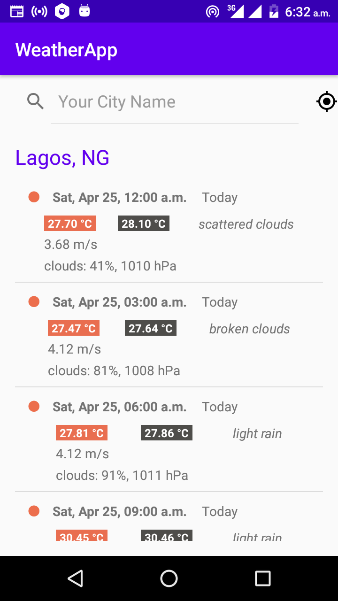

# WeatherApp
A simple android application that shows today’s weather forecast and 5 day weather forecast for any city, using the weather map API [https://openweathermap.org/api](https://openweathermap.org/api).

## Screenshots
 

## App features
* Uses the user's current location as default city
* Users enter the name of a city and get the latest weather forecast
* The app shows old data when there is no network.
-----------
## Technical requirements
* Written in Kotlin
* Developed based on Android MVVM architecture using android architecture components (ViewModel, Room, LiveData)
* Utilised Retrofit2 and Gson to consume the weather REST API
* Unit test for each feature
-------------
NOTE: To run this project
-------
* > register and get your api key at [https://openweathermap.org/api](https://openweathermap.org/api)
* > create a secret.properties file in the project root directory
* > put your api key in format **API_KEY="XXXXXXXXXXXXXXX"**

download the apk file here [link](app/release/app-release.apk).
